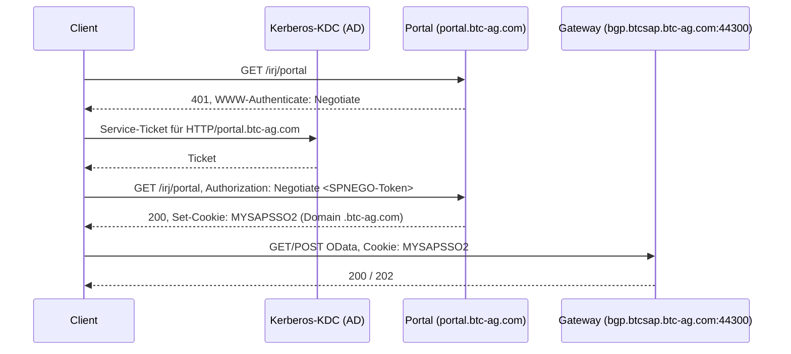

# SAP-Zeiterfassung – API-Referenz

Hier steht, was aus dem Live-System ausgelesen und getestet wurde (Stand 30.09.2026). Die API ist nicht
offiziell von BTC dokumentiert. Grundlage sind das `$metadata` des Services, echte Aufrufe und das
Verhalten der Standard-Fiori-App „Meine Zeiterfassung“ (HCM_TSH_MAN).

Platzhalter: `<PERNR>` steht für die 8-stellige Personalnummer (mit führenden Nullen).

## 1. Systemlandschaft

| Komponente | URL | Rolle |
|---|---|---|
| NetWeaver-Portal (AS Java 7.50) | `https://portal.btc-ag.com/irj/portal` | Einstieg, Kerberos-Anmeldung, gibt das SSO-Cookie aus |
| Fiori-Launchpad | `https://bgp.btcsap.btc-ag.com:44300/sap/bc/ui5_ui5/ui2/ushell/shells/abap/FioriLaunchpad.html?sap-client=300` | Weiterleitungsziel des Portal-Menüpunkts „Fiori @ BTC“ |
| SAP Gateway (System `BGP`, Mandant `300`) | `https://bgp.btcsap.btc-ag.com:44300` | OData-Services |
| Zeiterfassungs-Service | `…/sap/opu/odata/sap/HCM_TIMESHEET_MAN_SRV` | OData V2, CATS-Backend (Logsystem `BCPM300`) |

Alle Gateway-Aufrufe brauchen den Parameter `sap-client=300`.

## 2. Authentifizierung



- Das Portal verlangt `WWW-Authenticate: Negotiate` (SPNEGO). Das Kerberos-Ticket kommt aus dem
  Anmelde-Cache des Betriebssystems (Principal `…@BTCNET.BTC-AG.COM`).
- Nach der Anmeldung setzt das Portal **`MYSAPSSO2`** mit der Domain `.btc-ag.com`. Das Gateway
  vertraut diesem Logon-Ticket. Ein eigener Login am Gateway ist nicht nötig.
- Weitere Cookies (`JSESSIONID`, `saplb_*`, …) betreffen nur das Portal.
- Auf Windows-Rechnern in der Domäne liefert SSPI das Ticket aus der Windows-Anmeldung. Der SPN ist
  derselbe (`HTTP/portal.btc-ag.com`).

### Eigenheiten des Portals

| Problem | Symptom | Lösung |
|---|---|---|
| User-Agent-Prüfung | Ohne Browser-User-Agent kommt HTML mit „iView konnte nicht geöffnet werden … nicht kompatibel“. Die Anmeldung und `MYSAPSSO2` funktionieren trotzdem. | Browser-User-Agent mitschicken |
| TLS | Das Portal kann nur TLS 1.2 mit dem Cipher `AES128-GCM-SHA256` (RSA-Schlüsselaustausch). OpenSSL 3 in Python lehnt das ab (`SSLV3_ALERT_HANDSHAKE_FAILURE`). | Cipher zusätzlich erlauben: `DEFAULT:AES128-GCM-SHA256` |
| Zertifikate | Das Gateway-Zertifikat stammt von einer internen BTC-CA, die nicht in `certifi` enthalten ist (`CERTIFICATE_VERIFY_FAILED`). | System-Trust-Store verwenden (`truststore`) |

### Beispiel mit curl

```bash
UA="Mozilla/5.0 (Macintosh) AppleWebKit/537.36 Chrome/128.0 Safari/537.36"
curl -s --negotiate -u : -A "$UA" -c jar.txt -b jar.txt -o /dev/null https://portal.btc-ag.com/irj/portal
curl -s -b jar.txt "https://bgp.btcsap.btc-ag.com:44300/sap/bc/ui2/start_up?sap-client=300"   # zeigt den angemeldeten User
```

`-u :` bedeutet: Anmeldedaten aus dem Kerberos-Ticket nehmen. Die Cookie-Datei ist ein Login-Nachweis
und muss vertraulich behandelt werden.

## 3. Portal-Navigation (nur zur Orientierung)

Das Portal ist eine AJAX Framework Page. Das Menü kommt als JSON vom Navigation-Servlet:

```
POST https://portal.btc-ag.com/AFPServlet/NavigationServlet
Body: action=getSubTree&numberOfLevels=10&mode=nogzip
```

Relevante Knoten: „Employee Self-Services“ (Web Dynpro ESS), „Fiori @ BTC“ (URL-iView, leitet per
302 auf das Fiori-Launchpad weiter). Die Zeiterfassung ist die Fiori-App auf dem Gateway.

## 4. OData-Service `HCM_TIMESHEET_MAN_SRV`

Basis: `https://bgp.btcsap.btc-ag.com:44300/sap/opu/odata/sap/HCM_TIMESHEET_MAN_SRV`
Format: `$format=json` oder `Accept: application/json`.

Nicht freigegeben (HTTP 403) sind die Nachfolger- und Alternativ-Services `HCMFAB_TIMESHEET_MAINT_SRV`,
`HCM_TIMESHEET_MAN_V2_SRV`, `CATS_TIMESHEET_SRV` sowie der Gateway-Katalog.

### 4.1 Entity-Sets

| Entity-Set | Lesen | Schreiben | Zweck |
|---|---|---|---|
| `TimeDataList` | ✓ (Filter Pernr + Zeitraum) | – | Gebuchte Zeiten, zeilenweise pro Feld |
| `TimeEntries` | – (kein Filter auf Datum, `GET_ENTITY` nicht implementiert) | ✓ via `$batch` POST | Anlegen, Ändern, Löschen, Freigeben |
| `WorkCalendars` | ✓ | – | Sollstunden und Tagesstatus |
| `WorkListCollection` | ✓ | – | Arbeitsvorrat (buchbare PSP-Elemente) |
| `ConcurrentEmploymentSet` | ✓ (ohne Filter) | – | Personalnummer(n) des angemeldeten Users |
| `InitialInfos` | ✓ (Filter Pernr) | – | Profil-Einstellungen (Profil `ESS`, Uhrzeiterfassung an, …) |
| `ProfileFields` | ✓ | – | Eingabefelder des Profils |
| `ValueHelpList` | ✓ | – | Wertehilfen (AWART, BEMOT, …) |
| `Favorites` | ✓ | ✓ | Favoriten der Fiori-App (von der CLI nicht genutzt) |
| `Summaries`, `TimeData` | ✓ | – | Kachel-Zusammenfassung (von der CLI nicht genutzt) |

Filter mit Datumsbereich werden immer so formuliert (Datum als String `YYYYMMDD`):

```
$filter=Pernr eq '<PERNR>' and StartDate eq '20260928' and EndDate eq '20261004'
```

### 4.2 Personalnummer

```
GET ConcurrentEmploymentSet?sap-client=300&$format=json
→ d.results[0].Pernr   (z. B. "000xxxxx")
```

### 4.3 Gebuchte Zeiten – `TimeDataList`

```
GET TimeDataList?$filter=Pernr eq '<PERNR>' and StartDate eq '20260921' and EndDate eq '20261004'
```

Die Antwort kommt **zeilenweise pro Feld** (Entity-Attribut-Value). Die Zeilen einer Buchung haben
dieselbe `RecordNumber` und werden zusammengeführt:

```json
{"RecordNumber": "1", "FieldName": "WORKDATE", "FieldValue": "20261002", ...}
{"RecordNumber": "1", "FieldName": "TIME",     "FieldValue": "0.500", ...}
```

**Achtung:** `RecordNumber` beginnt an jedem Tag wieder bei `1` (mit Leerzeichen aufgefüllt, z. B. `"1 "`).
Über mehrere Tage ist sie also nicht eindeutig. Die Zeilen einer Buchung kommen aber zusammenhängend und
beginnen immer mit `WORKDATE`. Eine neue Buchung beginnt deshalb dort, wo `RecordNumber` wechselt oder ein Feld
zum zweiten Mal auftaucht. Wer nur nach `RecordNumber` gruppiert, bekommt bei Zeiträumen über mehrere Tage
Buchungen, die sich gegenseitig überschreiben.

Zusammengeführt sieht eine Buchung so aus:

| Feld | Beispiel | Bedeutung |
|---|---|---|
| `COUNTER` | `000027753684` | Buchungsnummer (Schlüssel für Ändern/Löschen) |
| `WORKDATE` | `20261002` | Datum |
| `STARTTIME` / `ENDTIME` | `073000` / `080000` | Uhrzeit von/bis (`HHMMSS`) |
| `TIME` | `0.500` | Stunden |
| `MEINH` | `H` | Einheit |
| `AWART` | `0800` | Ab-/Anwesenheitsart |
| `BEMOT` | `01` | Berechnungsmotiv |
| `POSID` | `NX.000037.20.0002` | PSP-Element |
| `DISPTEXT1` | `BTC-S: CSIRT Intel` | Bezeichnung des PSP-Elements |
| `LTXA1` | `CSIRT-6` | Kurztext (max. 40 Zeichen) |
| `NOTES` | | Langtext-Hinweis |
| `STATUS` | `MSAVE` | Status (siehe 4.7) |
| `REASON` | | Ablehnungsgrund |

Die Leistungsart (LSTAR) ist nicht enthalten.

### 4.4 Sollzeiten – `WorkCalendars`

```
GET WorkCalendars?$filter=Pernr eq '<PERNR>' and StartDate eq '20260928' and EndDate eq '20261004'
```

| Feld | Beispiel |
|---|---|
| `Date` | `20260930` |
| `TargetHours` | `8.00` |
| `WorkingDay` | `TRUE` / `FALSE` |
| `Status` | `MACTION`, `YACTION` (Tagesstatus, Bedeutung nicht abschließend geklärt) |

### 4.5 Arbeitsvorrat – `WorkListCollection`

Filter wie oben (typischerweise eine Woche). Auch diese Antwort kommt zeilenweise pro Feld, gruppiert
über `RecordNumber` (Int). Relevante Felder:

| Feld | Beispiel |
|---|---|
| `POSID` | `NX.000037.20.0001` |
| `CPR_OBJTEXT` / `DISPTEXTW1` | `BTC-S: CSIRT Operation` |
| `LSTAR` | `4065` (wird beim Buchen vom Backend ignoriert, siehe 4.6) |

### 4.6 Buchen, Ändern, Löschen – `TimeEntries` via `$batch`

Schreibzugriffe laufen wie in der Fiori-App über `POST $batch`. Darin steht je Buchung ein
`POST TimeEntries`. Welche Aktion ausgeführt wird, bestimmt das Feld `TimeEntryOperation`.

**CSRF-Token holen** (einmal pro Session):

```
GET /sap/opu/odata/sap/HCM_TIMESHEET_MAN_SRV/?sap-client=300
X-CSRF-Token: Fetch
→ Response-Header x-csrf-token: <token>
```

**Batch-Aufbau.** Das Gateway erlaubt **nur eine Operation pro Changeset**. Sonst kommt der Fehler
„Default changeset implementation allows only one operation“. Mehrere Buchungen brauchen deshalb
mehrere Changesets im selben Batch. Jedes Changeset wird einzeln verbucht, Teilerfolge sind möglich.

```http
POST /sap/opu/odata/sap/HCM_TIMESHEET_MAN_SRV/$batch?sap-client=300
Content-Type: multipart/mixed; boundary=batch_1
X-CSRF-Token: <token>
Accept: application/json

--batch_1
Content-Type: multipart/mixed; boundary=changeset_1

--changeset_1
Content-Type: application/http
Content-Transfer-Encoding: binary

POST TimeEntries?sap-client=300 HTTP/1.1
Content-Type: application/json
Accept: application/json
Content-Length: 312

{ ...TimeEntry-JSON... }
--changeset_1--
--batch_1--
```

Antwort: `202 Accepted` mit einem Multipart-Body. Darin steht pro Changeset entweder `HTTP/1.1 201
Created` mit der angelegten bzw. geänderten Entity oder eine Fehlerantwort (`4xx`) mit
`error.message.value` und `innererror.errordetails[]`.

**TimeEntry-JSON:**

| Feld | Werte |
|---|---|
| `Pernr` | `<PERNR>` |
| `Counter` | `""` beim Anlegen, sonst die 12-stellige Buchungsnummer |
| `TimeEntryOperation` | `C` = anlegen, `U` = ändern, `D` = löschen |
| `TimeEntryRelease` | `" "` = nur speichern, `"X"` = freigeben |
| `TimeEntryDataFields` | Komplextyp mit den CATS-Feldern (siehe unten) |

Benutzte `TimeEntryDataFields`:

| Feld | Format | Hinweis |
|---|---|---|
| `WORKDATE` | `"2026-10-02T00:00:00"` | Die Antwort liefert `/Date(ms)/` |
| `CATSHOURS` | `"0.25"` | Dezimal als String, bei `D` `"0.00"` |
| `BEGUZ` / `ENDUZ` | `"180000"` / `"181500"` | `HHMMSS` (Profil hat Uhrzeiterfassung) |
| `POSID` | `"NX.000037.20.0001"` | PSP-Element |
| `AWART` | `"0800"` | |
| `BEMOT` | `"01"` | |
| `LTXA1` | max. 40 Zeichen | |

Der Komplextyp enthält noch viele weitere CATS-Felder (`RKOSTL`, `RAUFNR`, `LONGTEXT_DATA`,
`-BTC-TICKET`, …). Die sind für dieses Profil nicht nötig.

**Beispiele:**

```json
// Anlegen (nur speichern)
{"Pernr": "<PERNR>", "Counter": "", "TimeEntryOperation": "C", "TimeEntryRelease": " ",
 "TimeEntryDataFields": {"WORKDATE": "2026-10-02T00:00:00", "CATSHOURS": "0.25",
   "BEGUZ": "180000", "ENDUZ": "181500", "POSID": "NX.000037.20.0001",
   "AWART": "0800", "BEMOT": "01", "LTXA1": "CSIRT-71"}}

// Ändern: vollständigen Datensatz mit Counter senden
{"Pernr": "<PERNR>", "Counter": "000027771010", "TimeEntryOperation": "U", "TimeEntryRelease": " ",
 "TimeEntryDataFields": { ...alle Felder wie beim Anlegen... }}

// Löschen
{"Pernr": "<PERNR>", "Counter": "000027771010", "TimeEntryOperation": "D", "TimeEntryRelease": " ",
 "TimeEntryDataFields": {"WORKDATE": "2026-10-02T00:00:00", "CATSHOURS": "0.00"}}
```

Beim Ändern wird der ganze Datensatz geschickt, nicht nur die geänderten Felder.

**Getestetes Verhalten:**

- `C`, `U` und `D` funktionieren (getestet am 30.09.2026 mit Testbuchungen, die danach gelöscht wurden).
- Die Antwort enthält die vollständige Entity inklusive `Counter` und `TimeEntryDataFields.STATUS`
  (`"10"` = in Bearbeitung/gespeichert).
- **LSTAR wird vom Backend abgeleitet.** Ob man `4065` mitschickt oder nichts, gespeichert wird
  immer `8990`.
- Ungültige Werte werden pro Changeset abgelehnt, zum Beispiel
  „The attendance/absence type 01/9999 does not exist on 02.10.2026“.
- **Ungetestet:** Freigeben (`U` mit `TimeEntryRelease: "X"`). Das entspricht dem Vorgehen der
  Standard-App, wurde aber nicht an echten Buchungen geprüft.

### 4.7 Wertelisten

`ValueHelpList?$filter=Pernr eq '<PERNR>' and FieldName eq '<FELD>'`

**BEMOT (Berechnungsmotiv):** `01` abrechenbar · `02` nicht abrechenbar · `05` Reisezeit

**AWART (Auszug):** `0800` Projekt · `0710` Meeting · `0720` Officetätigkeiten · `0420` Schulung ·
`0423` Einarbeitung · `0050` Ausbildung · `0400`–`0403` Fahrzeit · `0426`/`0436` Rufbereitschaft ·
`9001` Urlaub · `9002` Sonderurlaub · `9003` Gleittag

**ProfileFields (Profil `ESS`):** AWART, BEMOT, POSID, LTXA1 (editierbar), EXTAPPLICATION, EXTSYSTEM (nur lesen)

**STATUS in `TimeDataList`:**

| Wert | Bedeutung |
|---|---|
| `MSAVE` | gespeichert, nicht freigegeben (gesichert) |
| `MACTION` | vermutlich freigegeben (noch nicht abschließend geprüft) |
| `MAPPROVED`, `MREJECTED` | genehmigt / abgelehnt (angenommen, bisher nicht gesehen) |

## 5. Fehlerbilder

| Meldung | Ursache |
|---|---|
| `Ressource nicht gefunden für URI-Segment` | Entity-Set ohne Pflichtfilter abgefragt (z. B. `InitialInfos`, `ProfileFields` ohne Pernr) |
| `Eigenschaft StartDate in Typ TimeEntry nicht gefunden` | `TimeEntries` kann nicht nach Datum gefiltert werden, stattdessen `TimeDataList` verwenden |
| `Method 'TIMEENTRIES_GET_ENTITY' not implemented` | Einzelne Buchungen lassen sich nicht per Schlüssel lesen |
| `Default changeset implementation allows only one operation` | Mehrere Operationen in einem Changeset |
| HTTP 403 bei `$batch` / POST | CSRF-Token fehlt oder ist abgelaufen |
| HTTP 401 am Portal | Kein gültiges Kerberos-Ticket (`klist`, `kinit`) |

Für Backend-Admins: Die `innererror.transactionid` aus der Fehlerantwort lässt sich im Gateway-Fehlerlog
(`/IWFND/ERROR_LOG`) nachschlagen.
