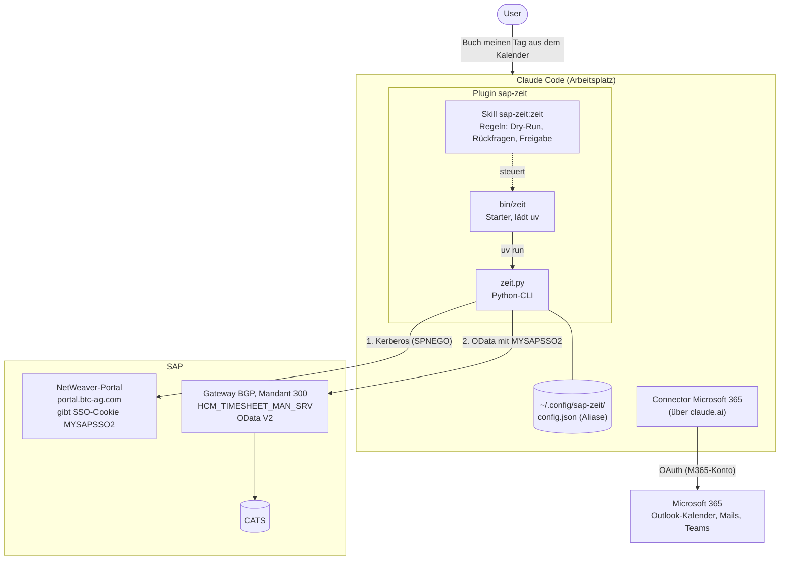
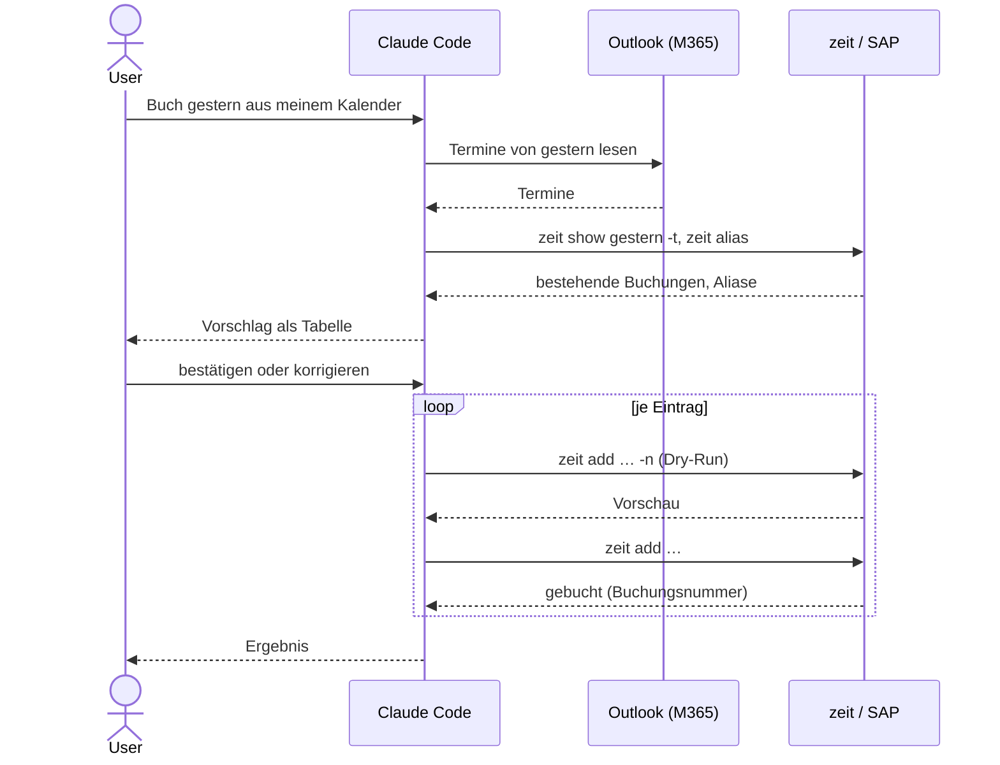

# zeit: SAP-Zeiterfassung mit Claude

`zeit` bucht Arbeitszeiten in der SAP-Zeiterfassung (CATS, Fiori-App „Meine Zeiterfassung“), ohne dass man die Fiori-Oberfläche öffnen muss. Gedacht ist es vor allem für die Nutzung über **Claude Code**: Man sagt Claude in normaler Sprache, was gebucht werden soll, und Claude erledigt den Rest. Mit dem **Microsoft-365-Connector** kann Claude die Buchungen direkt aus dem Outlook-Kalender vorschlagen.

**Kurz gesagt:**

- Anmeldung per Kerberos (Single Sign-on). Es gibt keine Passwörter, und es werden keine gespeichert.
- Anzeigen, Buchen, Ändern, Löschen und Freigeben von Zeiten.
- Claude zeigt vor jeder Buchung einen Dry-Run und bucht erst nach Bestätigung.
- Outlook-Termine können als Grundlage für Buchungsvorschläge dienen.

| | |
|---|---|
| Repository | Azure DevOps `btc-cloud-aws / KI Hackathon / gruppe7` |
| Plugin | `sap-zeit@gruppe7` |
| Plattformen | macOS (getestet), Windows und Linux (umgesetzt, ungetestet) |
| SAP-System | Gateway `BGP`, Mandant `300`, OData-Service `HCM_TIMESHEET_MAN_SRV` |

---

## Architektur



### Komponenten

| Komponente | Aufgabe |
|---|---|
| **Claude Code** | Nimmt die Anfrage in natürlicher Sprache entgegen, sammelt Informationen (Kalender, bestehende Buchungen) und ruft `zeit` auf. |
| **Plugin `sap-zeit`** | Bringt die CLI und den Skill in Claude Code. `zeit` liegt danach im PATH der Claude-Session. |
| **Skill `sap-zeit:zeit`** | Erklärt Claude die CLI und legt die Regeln fest: erst prüfen, dann Dry-Run, dann buchen. Löschen und Freigeben nur auf ausdrücklichen Wunsch. |
| **`bin/zeit`** | Startskript. Lädt beim ersten Aufruf `uv` (mit Prüfsummen-Check), `uv` holt Python und die Pakete. Am System wird nichts verändert. |
| **`zeit.py`** | Die eigentliche CLI. Meldet sich per Kerberos an, liest und schreibt über den OData-Service. |
| **`config.json`** | Aliase für Projekte und optionale Einstellungen. Enthält keine Zugangsdaten. |
| **Connector Microsoft 365** | Gibt Claude Lesezugriff auf Outlook-Kalender, Mails und Teams. Wird in claude.ai verbunden und steht dann auch in Claude Code zur Verfügung. |
| **SAP-Portal** | Nimmt die Kerberos-Anmeldung an und liefert das SSO-Cookie `MYSAPSSO2`. |
| **SAP Gateway** | Stellt den Zeiterfassungs-Service bereit. Akzeptiert das Cookie aus dem Portal. |

### Anmeldung

1. `zeit.py` ruft das Portal auf und meldet sich per Kerberos (SPNEGO) an. Das Ticket stammt aus der normalen Rechner-Anmeldung (macOS: Ticket-Cache, Windows: Domänenanmeldung per SSPI).
2. Das Portal setzt das SSO-Cookie `MYSAPSSO2`.
3. Mit diesem Cookie spricht `zeit.py` den OData-Service am Gateway an.
4. Nach dem Aufruf wird nichts gespeichert. Jeder Aufruf meldet sich neu an (etwa eine Sekunde).

Schreibzugriffe laufen wie in der Fiori-App als `$batch` auf `TimeEntries`, mit einem CSRF-Token pro Aufruf.

---

## Einrichtung

### Voraussetzungen

- **Claude Code** ist installiert und mit dem BTC-Konto bei claude.ai angemeldet.
- **Zugriff auf das Azure-DevOps-Repository** `btc-cloud-aws / KI Hackathon / gruppe7` per SSH (SSH-Key in Azure DevOps hinterlegt).
- **Firmennetz oder VPN** ist aktiv, sonst sind Portal und Gateway nicht erreichbar.
- **Kerberos-Ticket** liegt vor. Auf dem Mac prüfen mit `klist`. Unter Windows reicht die Anmeldung mit dem Domänenkonto.
- Beim ersten Start **Internetzugriff** (GitHub, PyPI) für den einmaligen Download von uv, Python und Paketen (ca. 120 MB).

### Schritt 1: Plugin aktivieren

In Claude Code nacheinander eingeben:

```
/plugin marketplace add git@ssh.dev.azure.com:v3/btc-cloud-aws/KI%20Hackathon/gruppe7
/plugin install sap-zeit@gruppe7
```

Danach mit `/plugin` prüfen, ob `sap-zeit` als installiert und aktiv angezeigt wird. Falls der Skill nicht sofort greift, Claude Code einmal neu starten.

### Schritt 2: Funktion testen

In Claude Code schreiben:

```
Zeig meine Woche
```

Beim allerersten Aufruf erscheint `Einmalige Einrichtung: lade uv …`. Das dauert etwa 10 Sekunden. Danach braucht ein Aufruf rund 2 Sekunden.

### Schritt 3 (optional): Aliase anlegen

Aliase sind Kurznamen für häufig gebuchte PSP-Elemente. Sie machen Buchungen kürzer und helfen Claude bei der Zuordnung von Kalenderterminen.

```
Leg einen Alias "csop" für das Projekt CSIRT Operation an
Leg einen Alias "ausb" für Ausbildungsbetreuung an, nicht abrechenbar
```

Oder direkt im Terminal:

```bash
zeit alias add csop "csirt op"
zeit alias add ausb ausbildungsbetreuung --bemot 02
```

### Schritt 4 (optional): Microsoft-365-Connector verbinden

Damit Claude Buchungen aus dem Outlook-Kalender vorschlagen kann:

1. In **claude.ai** öffnen: **Einstellungen → Connectors**.
2. **Microsoft 365** auswählen und **Verbinden** klicken.
3. Mit dem BTC-Konto anmelden und die angefragten Berechtigungen bestätigen.
4. In Claude Code mit `/mcp` prüfen, ob „claude.ai Microsoft 365“ als verbunden angezeigt wird.

Ist der Connector in claude.ai nicht sichtbar, ist er für die Organisation noch nicht freigegeben. Dann an die Claude-Admins wenden.

### Updates

```
/plugin marketplace update gruppe7
```

### Alternative: nur als Kommandozeilen-Tool

Ohne Claude Code lässt sich `zeit` auch direkt im Terminal nutzen. Im geklonten Repository:

```bash
uv tool install --editable .     # stellt den Befehl `zeit` bereit
```

---

## Nutzung mit Claude

### Beispiele

| Anfrage an Claude | Was passiert |
|---|---|
| „Zeig meine Woche“ | `zeit show`: Buchungen mit Ist- und Sollstunden pro Tag |
| „Was hab ich gestern gebucht?“ | `zeit show gestern -t` |
| „Welche Projekte kann ich buchen?“ | `zeit projekte`: Arbeitsvorrat mit PSP-Elementen |
| „Buch heute 9-10 CSIRT-71 auf CSIRT Operation“ | Prüft den Tag, zeigt einen Dry-Run und bucht |
| „Verschieb die Buchung von 9 Uhr auf 9:30-10:30“ | Sucht die Buchungsnummer und ändert per `zeit edit` |
| „Lösch die doppelte Buchung von heute“ | Zeigt die Buchung und löscht erst nach Bestätigung |
| „Schau in meinen Kalender von gestern und schlag mir Buchungen vor“ | Liest Outlook-Termine und erstellt einen Buchungsvorschlag |
| „Gleich meine Termine dieser Woche mit den Buchungen ab“ | Zeigt Tage mit Lücken oder Überschneidungen |
| „Gib meine Zeiten dieser Woche frei“ | `zeit freigeben`: nur auf ausdrücklichen Wunsch |

### So bucht Claude

Der Skill legt fest, dass Claude bei Buchungen immer so vorgeht:

1. **Tag prüfen:** Claude sieht mit `zeit show DATUM -t` nach, was schon gebucht ist, um doppelte Buchungen und Überschneidungen zu vermeiden.
2. **Unklares klären:** Datum, Uhrzeit von-bis, Projekt und Kurztext müssen feststehen. Nennt man nur eine Dauer, fragt Claude nach der Uhrzeit oder schlägt die nächste freie Lücke vor. Passen mehrere Projekte, fragt Claude nach.
3. **Dry-Run:** Claude führt die Buchung mit `-n` aus und zeigt das Ergebnis.
4. **Buchen:** Erst nach Bestätigung wird wirklich gebucht.
5. **Löschen und Freigeben** macht Claude nur auf ausdrücklichen Wunsch.

Lesende Befehle (`show`, `projekte`, `alias`) darf Claude ohne Rückfrage ausführen. Für schreibende Befehle (`add`, `edit`, `rm`, `freigeben`) fragt Claude Code jedes Mal nach der Erlaubnis.

### Buchungen aus dem Outlook-Kalender

Mit verbundenem Microsoft-365-Connector kann Claude den Kalender als Grundlage nutzen. Beispiel:

```
Buch meinen gestrigen Tag anhand meines Kalenders
```

Ablauf:



1. Claude liest die Termine des Tages aus Outlook.
2. Claude liest die bestehenden Buchungen, die Aliase und bei Bedarf den Arbeitsvorrat.
3. Claude ordnet die Termine den PSP-Elementen zu. Grundlage sind Betreff, Aliase und frühere Buchungen mit ähnlichem Kurztext.
4. Claude zeigt einen Vorschlag als Tabelle (Uhrzeit, Projekt, Kurztext, BEMOT) und nennt Termine, die sich nicht eindeutig zuordnen lassen.
5. Nach Bestätigung oder Korrektur bucht Claude einen Eintrag nach dem anderen, jeweils mit Dry-Run.

Der Skill regelt nur das Buchen, nicht die Auswahl der Termine. Private oder abgesagte Termine im Vorschlag daher prüfen oder die Regel dafür in der `CLAUDE.md` festhalten (siehe Tipps).

### Tipps für gute Vorschläge

- **Ticketnummer in den Terminbetreff** schreiben (z. B. `CSIRT-71 Abstimmung`). Claude übernimmt sie dann als Kurztext.
- **Aliase** für die wichtigsten Projekte anlegen.
- **Feste Zuordnungen** in der persönlichen `~/.claude/CLAUDE.md` hinterlegen, zum Beispiel:

```markdown
## Zeiterfassung
- Termine mit "Daily" oder "Refinement" im Betreff → Alias csop, Kurztext "CSIRT Daily"
- Termine mit "Azubi" im Betreff → Alias ausb (BEMOT 02)
- Pausen und private Termine nie buchen
```

- Buchungen kurz nach dem Tag machen lassen. Dann ist der Kalender noch aktuell und Rückfragen sind leicht zu beantworten.

---

## Befehlsreferenz

Für die direkte Nutzung im Terminal. Claude nutzt dieselben Befehle.

| Befehl | Kurzform | Zweck |
|---|---|---|
| `zeit show [DATUM] [-t] [--bis DATUM]` | `w` | Buchungen der Woche (oder mit `-t` eines Tages) mit Ist/Soll |
| `zeit projekte [SUCHE…]` | `p` | Arbeitsvorrat durchsuchen |
| `zeit add DATUM VON-BIS PROJEKT TEXT… [--bemot] [--awart] [-f] [-n]` | `b` | Zeit buchen |
| `zeit edit NR [--datum] [--zeit] [--projekt] [--text…] [--bemot] [--awart] [-f] [-n]` | `e` | Buchung ändern (nur angegebene Felder) |
| `zeit rm NR… [-y]` | `del` | Buchung(en) löschen, mit Rückfrage |
| `zeit freigeben [DATUM] [-t] [-y]` | `release` | Gespeicherte Buchungen der Woche freigeben, mit Rückfrage |
| `zeit alias [list \| add NAME PROJEKT [--bemot] \| rm NAME]` | | Kurznamen für Projekte verwalten |

Optionen: `-n` Dry-Run (nichts senden), `-f` direkt freigeben, `-y` ohne Rückfrage, `-t` nur ein Tag.

### Eingabeformate

| Eingabe | Formate |
|---|---|
| Datum | `heute`/`h`, `gestern`/`g`, `vorgestern`, `morgen`, `mo`…`so` (aktuelle Woche), `-2`, `30.09.`, `30.09.2026`, `2026-09-30` |
| Zeitraum | `8:30-10`, `13-14:15`, `0830-1000` (nicht über Mitternacht) |
| Projekt | Alias, PSP-Element (`NX.000037.20.0001`) oder Suchbegriffe (`"csirt op"`) |
| Kurztext | höchstens 40 Zeichen, meist Ticketnummer plus Stichwort |
| BEMOT | `01` abrechenbar (Default), `02` nicht abrechenbar, `05` Reisezeit |
| AWART | `0800` Projekt (Default), z. B. `0710` Meeting, `9001` Urlaub |

### Beispiele

```bash
zeit show                                        # aktuelle Woche
zeit show gestern -t                             # nur gestern
zeit add heute 8:30-10 "csirt op" CSIRT-71       # Projekt per Suchbegriff
zeit add mo 13-14 NE.066926.10.0004 CCEWE-11700  # Projekt per PSP-Element
zeit add heute 9-9:15 ausb "Ausbildung" -n       # Dry-Run
zeit edit 27753676 --zeit 8:45-9:30
zeit rm 27753676
zeit freigeben
```

### Anzeige von `zeit show`

Pro Tag: Marker, Datum, Ist/Soll. Darunter je Buchung: Buchungsnummer, von-bis, Stunden, BEMOT, Projekt, Kurztext, Status.

| Marker | Bedeutung |
|---|---|
| `✓` | Soll erreicht |
| `!` | Soll nicht erreicht |
| `·` | Tag ohne Soll |

---

## Konfiguration

Datei: `~/.config/sap-zeit/config.json`. Sie wird beim ersten `zeit alias add` angelegt.

```json
{
  "aliases": {
    "csop": {"posid": "NX.000037.20.0001"},
    "ausb": {"posid": "NM.000031.20.0005", "bemot": "02"}
  }
}
```

Optionale Schlüssel: `pernr` (Personalnummer, sonst automatisch ermittelt), `default_awart`, `default_bemot`, `portal_url`, `service_url`, `sap_client`. Für den Normalfall sind die Defaults passend.

---

## Sicherheit und Datenschutz

- **Keine Zugangsdaten:** Die Anmeldung läuft über das Kerberos-Ticket der Rechner-Anmeldung. Weder Passwörter noch Cookies werden gespeichert.
- **Nur eigene Daten:** Gebucht wird immer auf die Personalnummer des angemeldeten Users.
- **Kontrolle vor dem Schreiben:** Claude zeigt vor jeder Buchung einen Dry-Run, Claude Code fragt vor jedem schreibenden Befehl nach der Erlaubnis.
- **Kalenderdaten:** Mit dem Microsoft-365-Connector liest Claude Termine, Mails oder Chats. Diese Inhalte werden von Claude verarbeitet. Den Connector nur im Rahmen der BTC-Vorgaben nutzen.
- **Echte Buchungen:** Alles, was gebucht wird, landet in der Abrechnung und bei der Führungskraft. Vorschläge von Claude vor der Bestätigung prüfen.

---

## Fehlerbehebung

| Meldung | Lösung |
|---|---|
| `Kerberos-Anmeldung fehlgeschlagen` | VPN bzw. Firmennetz prüfen. Mac: in Claude Code `! kinit` ausführen oder im Terminal `klist` / `kinit`. Windows: mit dem Domänenkonto angemeldet? |
| `Portal nicht erreichbar` | VPN bzw. Firmennetz prüfen |
| `… Projekte passen zu …` | Suchbegriff genauer angeben, PSP-Element verwenden oder Alias anlegen |
| `Kein Projekt im Arbeitsvorrat passt zu …` | Mit `zeit projekte` die buchbaren Projekte ansehen. Fehlt das Projekt, ist es in SAP nicht im Arbeitsvorrat. |
| `… von SAP abgelehnt: …` | Die SAP-Meldung beschreibt die Ursache, z. B. eine ungültige AWART. Werte korrigieren. |
| `Kurztext ist … Zeichen lang` | Kurztext auf 40 Zeichen kürzen |
| `Download von uv fehlgeschlagen` | Kein Internet oder Proxy blockiert. `brew install uv` oder Proxy (`https_proxy`) prüfen. |
| Plugin-Installation schlägt fehl | SSH-Zugriff auf Azure DevOps prüfen (SSH-Key hinterlegt?) |
| Claude findet keine Kalendertermine | Mit `/mcp` prüfen, ob der Microsoft-365-Connector verbunden ist |

---

## Bekannte Einschränkungen

- Windows und Linux sind umgesetzt, aber nicht auf echten Rechnern getestet.
- Die **Freigabe** ist noch nicht an echten Buchungen getestet.
- Mehrere Operationen in einem Aufruf (`rm` mit mehreren Nummern, `freigeben`) sind nicht atomar. Ein Teil kann erfolgreich sein, ein anderer nicht. Die CLI meldet das.
- Langtexte, Favoriten und Buchungen ohne Uhrzeit (nur Stunden) werden nicht unterstützt.
- Die Leistungsart setzt SAP selbst (aktuell `8990`).
- Die Bedeutung einiger Status-Codes (`MACTION`, `YACTION`) ist nicht abschließend geklärt.

---

## Weiterführende Dokumentation

Im Repository unter `docs/`:

- `API.md`: SAP-Schnittstelle (Anmeldung, OData-Service, `$batch`-Format, Felder, Fehlerbilder)
- `FUNKTIONSWEISE.md`: Aufbau der CLI, Projektauflösung, Befehle im Detail
- `skills/zeit/SKILL.md`: Regeln, nach denen Claude die CLI bedient
