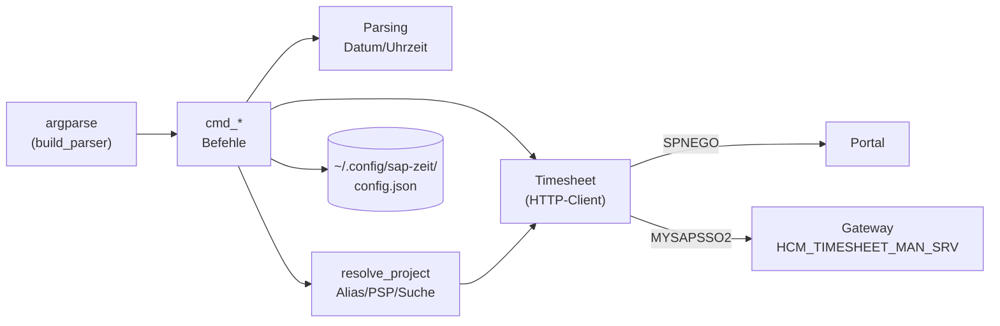

# Funktionsweise von `zeit`

`zeit` ist ein einzelnes Python-Modul (`zeit.py`) und nutzt die Bibliotheken `requests`,
`requests-gssapi` und `truststore`. Was die SAP-Schnittstelle kann, steht in [API.md](API.md).

## Überblick



Ablauf eines Aufrufs:

1. `main()` liest die Konfiguration (`load_config`) und die Argumente.
2. Außer bei `alias list` und `alias rm` wird ein `Timesheet` erzeugt. Dabei läuft sofort die
   Kerberos-Anmeldung.
3. Der passende `cmd_*`-Befehl liest oder schreibt über `Timesheet`.
4. Fachliche Fehler werfen `ZeitError`. `main()` gibt sie als `Fehler: …` auf stderr aus und
   beendet sich mit Exit-Code 1. Strg+C ergibt Exit-Code 130.

## Bausteine

### Konfiguration

`DEFAULTS` enthält Portal- und Service-URL, den Mandanten und die Default-Werte für AWART (`0800`)
und BEMOT (`01`). `config.json` überschreibt diese Werte. `save_config` schreibt nur Werte, die vom
Default abweichen, sowie die Aliase.

```json
{
  "aliases": {
    "csop": {"posid": "NX.000037.20.0001"},
    "ausb": {"posid": "NM.000031.20.0005", "bemot": "02"}
  },
  "pernr": "000xxxxx"
}
```

`pernr` ist optional. Ohne diesen Wert ermittelt die CLI die Personalnummer über
`ConcurrentEmploymentSet`. In der Konfiguration stehen **keine** Zugangsdaten.

### `Timesheet` – HTTP-Client

| Methode | Aufgabe | SAP-Aufruf |
|---|---|---|
| `_login()` | Kerberos-Anmeldung am Portal, prüft `MYSAPSSO2` | `GET /irj/portal` mit SPNEGO |
| `pernr` (Property, lazy) | Personalnummer | `ConcurrentEmploymentSet` |
| `get(set, filter)` | Generischer OData-Read, Fehler ergeben `ZeitError` | `GET <Set>?$filter=…` |
| `entries(von, bis)` | Buchungen, von Zeilen je Feld zu Datensätzen zusammengeführt, sortiert | `TimeDataList` |
| `calendar(von, bis)` | Sollstunden je Tag | `WorkCalendars` |
| `worklist(tag)` | Arbeitsvorrat der Woche als `{posid, text}` | `WorkListCollection` |
| `find_entry(counter, um)` | Sucht eine Buchung über ihre Nummer (8 Wochen zurück bis 2 Wochen vor) | `TimeDataList` |
| `_csrf_token()` | Holt das CSRF-Token einmal pro Lauf und speichert es | `GET /` mit `X-CSRF-Token: Fetch` |
| `submit(entries)` | Baut den `$batch` (ein Changeset je Buchung), sendet ihn und wertet jede Teilantwort aus | `POST $batch` |

Die Session nutzt `_TLSAdapter`. Der Adapter verwendet den macOS-Trust-Store (`truststore`) und
erlaubt zusätzlich den Cipher `AES128-GCM-SHA256`, den das Portal braucht. Außerdem schickt die
Session einen Browser-User-Agent mit, weil das Portal andere Clients ablehnt.

Sessions und Cookies werden **nicht** gespeichert. Jeder Aufruf meldet sich neu per Kerberos an
(etwa eine Sekunde). Der Vorteil: Es liegt kein Login-Nachweis auf der Platte.

`submit()` wertet die Multipart-Antwort Changeset für Changeset aus (`_batch_parts`). Wenn ein
Changeset fehlschlägt, meldet die CLI, wie viele Operationen erfolgreich waren, und die SAP-Meldungen
(`_sap_message` liest `message.value` und `errordetails`). Mehrere Buchungen (`rm`, `freigeben`)
sind deshalb **nicht atomar**: Ein Teil kann durchgehen, ein anderer nicht.

`time_entry()` baut das JSON für `TimeEntries`. Die Stunden (`CATSHOURS`) rechnet es aus Von und Bis
aus. Beim Löschen schickt es nur Datum und `0.00`.

### Projektauflösung (`resolve_project`)

Die Projektangabe bei `add`, `edit` und `alias add` wird in dieser Reihenfolge aufgelöst:

1. **Alias** aus der Konfiguration. Liefert das PSP-Element und optional Default-BEMOT und -AWART.
2. **Exaktes PSP-Element** im Arbeitsvorrat (Groß-/Kleinschreibung egal).
3. Ein Alias, dessen PSP-Element nicht im Arbeitsvorrat steht, wird trotzdem verwendet.
4. **Suchbegriff:** Alle Wörter müssen in „PSP-Element + Bezeichnung“ vorkommen. Bei genau einem
   Treffer wird dieser verwendet. Bei mehreren listet die CLI bis zu 15 Kandidaten auf und bricht
   ab. Bei keinem Treffer kommt ein Fehler.

Welche Werte gelten (gilt für BEMOT und AWART):
- bei `add`: `--bemot`, dann Alias, dann Config-Default
- bei `edit`: `--bemot`, dann Alias, dann bisheriger Wert der Buchung, dann Config-Default

### Eingabeformate

| Eingabe | Formate | Funktion |
|---|---|---|
| Datum | `heute`/`h`, `gestern`/`g`, `vorgestern`, `morgen`, `mo`…`so` (aktuelle Woche), `+1`/`-2`, `30.09.`, `30.09.26`, `30.09.2026`, `2026-09-30` | `parse_date` |
| Uhrzeit | `8`, `8:30`, `0830`, `24` | `parse_time` → `HHMMSS` |
| Zeitraum | `VON-BIS`, z. B. `8:30-10` (Ende muss nach Beginn liegen, kein Zeitraum über Mitternacht) | `parse_range` |
| Buchungsnummer | mit oder ohne führende Nullen (`27753676`) | wird auf 12 Stellen aufgefüllt |

Der Kurztext wird vor dem Senden auf 40 Zeichen geprüft (`LTXA1_MAX`).

## Befehle

| Befehl | Kurzform | Liest | Schreibt | Rückfrage |
|---|---|---|---|---|
| `show [DATUM] [-t] [--bis DATUM]` | `woche`, `w` | TimeDataList, WorkCalendars | – | – |
| `projekte [SUCHE…]` | `p` | WorkListCollection | – | – |
| `add DATUM VON-BIS PROJEKT TEXT… [--bemot] [--awart] [-f] [-n]` | `buche`, `b` | WorkListCollection | `C` | – (`-n` = Dry-Run) |
| `edit COUNTER [--datum] [--zeit] [--projekt] [--text…] [--bemot] [--awart] [-f] [-n] [--date]` | `e` | TimeDataList, WorkListCollection | `U` | – |
| `rm COUNTER… [-y] [--date]` | `del`, `loesche` | TimeDataList | `D` | ja (außer `-y`) |
| `freigeben [DATUM] [-t] [-y]` | `release` | TimeDataList | `U` + `X` | ja (außer `-y`) |
| `alias [list\|add NAME PROJEKT [--bemot] [--awart]\|rm NAME]` | | WorkListCollection (nur `add`) | Config | – |

Hinweise:

- **`show`** zeigt pro Tag Ist- und Sollstunden. `✓` heißt Soll erreicht, `!` heißt Soll nicht
  erreicht, `·` heißt Tag ohne Soll. Tage ohne Soll und ohne Buchungen werden nicht angezeigt.
- **`edit`** schickt den ganzen Datensatz. Nicht angegebene Felder übernimmt die CLI aus der
  bestehenden Buchung. `--date` braucht man nur für Buchungen, die mehr als 8 Wochen zurückliegen.
- **`freigeben`** nimmt alle Buchungen mit Status `MSAVE` aus der Woche (oder mit `-t` aus dem Tag)
  und schickt sie mit `TimeEntryRelease = "X"` erneut. *Noch nicht an echten Buchungen getestet.*
- **`-f` bei `add`/`edit`** gibt direkt beim Speichern frei.

## Bekannte Einschränkungen

- Die Freigabe ist ungetestet (siehe oben).
- Die Bedeutung der Status-Codes `MACTION`, `YACTION` usw. ist nicht vollständig geklärt. Die
  Anzeige „freigegeben“ für `MACTION` ist eine Annahme.
- Die Leistungsart setzt das Backend fest auf `8990`. Die CLI kann sie nicht beeinflussen.
- Langtexte, Favoriten und Buchungen ohne Uhrzeit (nur Stunden) werden nicht unterstützt.
- Mehrfach-Operationen sind nicht atomar (eine Operation pro Changeset).
- Die TLS- und User-Agent-Anpassungen hängen am aktuellen Portal-Setup. Wenn das Portal modernisiert
  wird, kann der Cipher-Zusatz in `_TLSAdapter` entfallen.

## Entwicklung

```bash
uv venv .venv && uv pip install --python .venv/bin/python requests requests-gssapi truststore
.venv/bin/python zeit.py show
.venv/bin/python zeit.py add heute 8-9 csop Test -n   # Dry-Run zeigt das JSON, das gesendet würde
```

Neue Lesezugriffe gehen über `Timesheet.get(<EntitySet>, <Filter>)`. Neue Schreiboperationen bauen
ihr JSON mit `time_entry()` und senden es mit `Timesheet.submit()`.
