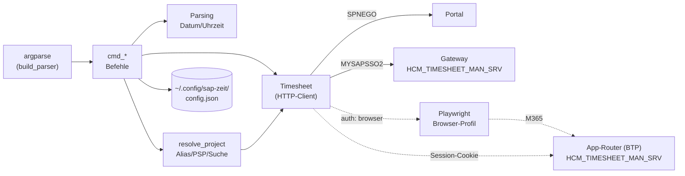

# Funktionsweise von `zeit`

`zeit` ist ein einzelnes Python-Modul (`zeit.py`) und nutzt die Bibliotheken `requests`,
`requests-gssapi` und `truststore`, für die Browser-Anmeldung außerdem `playwright`. Was die SAP-Schnittstelle kann, steht in [API.md](API.md).

## Überblick



Ablauf eines Aufrufs:

1. `main()` liest die Argumente und die Konfiguration (`load_config`) für das gewählte System.
2. Außer bei `alias list`, `alias rm` und `login` wird ein `Timesheet` erzeugt. Dabei läuft sofort die
   Anmeldung, je nach `auth` per Kerberos oder über das Browser-Profil.
3. Der passende `cmd_*`-Befehl liest oder schreibt über `Timesheet`.
4. Fachliche Fehler werfen `ZeitError`. `main()` gibt sie als `Fehler: …` auf stderr aus und
   beendet sich mit Exit-Code 1. Strg+C ergibt Exit-Code 130.

## Bausteine

### Konfiguration

`DEFAULTS` enthält Portal- und Service-URL, den Mandanten und die Default-Werte für AWART (`0800`)
und BEMOT (`01`). `config.json` überschreibt diese Werte. Ist ein System gewählt (`-s NAME`, sonst
`$ZEIT_SYSTEM`, sonst `"system"` in der Config), überschreiben dessen Einträge unter `systems` die
Werte noch einmal. Ohne System oder mit `-s kerberos` gilt die oberste Ebene, also Kerberos. Die Aliase gelten für alle Systeme. `save_config` schreibt die Config-Datei
zurück und ändert dabei nur die Aliase bzw. das System, das `zeit login` einrichtet.

```json
{
  "aliases": {
    "csop": {"posid": "NX.000037.20.0001"},
    "ausb": {"posid": "NM.000031.20.0005", "bemot": "02"}
  },
  "pernr": "000xxxxx",
  "systems": {
    "btp": {
      "auth": "browser",
      "login_url": "https://…launchpad.cfapps.eu20.hana.ondemand.com/site?siteId=…",
      "service_url": "https://…/sap/opu/odata/sap/HCM_TIMESHEET_MAN_SRV",
      "sap_client": ""
    }
  }
}
```

`pernr` ist optional. Ohne diesen Wert ermittelt die CLI die Personalnummer über
`ConcurrentEmploymentSet`. In der Konfiguration stehen **keine** Zugangsdaten.

### `Timesheet` – HTTP-Client

| Methode | Aufgabe | SAP-Aufruf |
|---|---|---|
| `_login()` | Kerberos-Anmeldung am Portal, prüft `MYSAPSSO2`; bei `auth: "browser"` stattdessen `_browser_login()` | `GET /irj/portal` mit SPNEGO |
| `_browser_login()` | Holt die Cookies des App-Routers über `_browser_session()`, prüft Weiterleitungen (`_check_redirect`) | `GET <service_url>/` im headless Browser |
| `pernr` (Property, lazy) | Personalnummer | `ConcurrentEmploymentSet` |
| `get(set, filter)` | Generischer OData-Read, Fehler ergeben `ZeitError` | `GET <Set>?$filter=…` |
| `entries(von, bis)` | Buchungen, von Zeilen je Feld zu Datensätzen zusammengeführt, sortiert | `TimeDataList` |
| `calendar(von, bis)` | Sollstunden je Tag | `WorkCalendars` |
| `worklist(tag)` | Arbeitsvorrat der Woche als `{posid, text}` | `WorkListCollection` |
| `find_entry(counter, um)` | Sucht eine Buchung über ihre Nummer (8 Wochen zurück bis 2 Wochen vor) | `TimeDataList` |
| `_csrf_token()` | Holt das CSRF-Token einmal pro Lauf und speichert es | `GET /` mit `X-CSRF-Token: Fetch` |
| `submit(entries)` | Baut den `$batch` (ein Changeset je Buchung), sendet ihn und wertet jede Teilantwort aus | `POST $batch` |

Die Kerberos-Anmeldung übernimmt `_negotiate_auth()`. Unter macOS und Linux nutzt sie `requests-gssapi`
(GSSAPI, Ticket-Cache des Betriebssystems), unter Windows `requests-negotiate-sspi` (SSPI, Windows-Anmeldung).
Der Hostname für den SPN wird fest vorgegeben, damit SSPI ihn nicht per DNS kanonisiert.
Welche Pakete installiert werden, steuern Plattform-Marker im Skript-Header (PEP 723) und in `pyproject.toml`.

Die Session nutzt `_TLSAdapter`. Der Adapter verwendet den macOS-Trust-Store (`truststore`) und
erlaubt zusätzlich den Cipher `AES128-GCM-SHA256`, den das Portal braucht. Außerdem schickt die
Session einen Browser-User-Agent mit, weil das Portal andere Clients ablehnt.

Bei Kerberos werden Sessions und Cookies **nicht** gespeichert. Jeder Aufruf meldet sich neu an
(etwa eine Sekunde). Der Vorteil: Es liegt kein Login-Nachweis auf der Platte.

`submit()` wertet die Multipart-Antwort Changeset für Changeset aus (`_batch_parts`). Wenn ein
Changeset fehlschlägt, meldet die CLI, wie viele Operationen erfolgreich waren, und die SAP-Meldungen
(`_sap_message` liest `message.value` und `errordetails`). Mehrere Buchungen (`rm`, `freigeben`)
sind deshalb **nicht atomar**: Ein Teil kann durchgehen, ein anderer nicht.

`time_entry()` baut das JSON für `TimeEntries`. Die Stunden (`CATSHOURS`) rechnet es aus Von und Bis
aus. Beim Löschen schickt es nur Datum und `0.00`.

### Browser-Anmeldung (`auth: "browser"`)

Für Systeme mit M365-Login, zum Beispiel das Launchpad auf der SAP BTP, gibt es kein Kerberos.
Stattdessen hat jedes System ein eigenes Browser-Profil unter `~/.local/share/sap-zeit/browser/<NAME>/<Browser>`.
Genommen wird der Standardbrowser, falls er Chrome oder Edge ist, sonst Chrome, Edge, Chromium (fest: `"browser"`).
Jeder Browser hat ein eigenes Profil, weil Chrome die verschlüsselten Cookies eines Edge-Profils nicht lesen kann.
Dieses Profil ist vom normalen Browser des Users getrennt. `zeit` liest keine Cookies aus dem
normalen Browser.

- `zeit login NAME --url LAUNCHPAD-URL` öffnet Edge, Chrome oder Chromium (in dieser Reihenfolge,
  festlegbar mit `"browser"`) sichtbar mit diesem Profil. Der User meldet sich an und öffnet
  „Meine Zeiterfassung“. `zeit` erkennt die OData-Service-URL und den `sap-client` an den Requests
  der App und speichert sie. Danach schließt sich das Fenster.
- Bei jedem weiteren Aufruf öffnet `_browser_session()` die Service-URL headless im Profil. Der
  App-Router leitet zu XSUAA und Microsoft weiter. Weil das Profil die Microsoft-Anmeldung hält
  („Angemeldet bleiben“), läuft das ohne Rückfrage durch. Die Cookies des App-Routers gehen dann in
  die `requests`-Session, danach wird der Browser geschlossen. Das dauert einige Sekunden.
- Landet der Browser nicht wieder auf dem Service-Host (MFA oder Anmeldung abgelaufen), oder leitet
  der App-Router später auf die Anmeldung um, meldet `zeit`: `zeit login NAME` ausführen.

Das Browser-Profil ist ein Login-Nachweis für das M365-Konto und muss wie ein Passwort geschützt
werden. Solange `zeit login` läuft, ist das Profil gesperrt. Parallele Aufrufe schlagen dann fehl.

### Projektauflösung (`resolve_project`)

Die Projektangabe bei `add`, `edit` und `alias add` wird in dieser Reihenfolge aufgelöst:

1. **Alias** aus der Konfiguration. Liefert das PSP-Element und optional Default-BEMOT und -AWART.
2. **Exaktes PSP-Element** im Arbeitsvorrat (Groß-/Kleinschreibung egal).
3. Ein Alias, dessen PSP-Element nicht im Arbeitsvorrat steht, wird trotzdem verwendet.
4. **Suchbegriff:** Alle Wörter müssen in „PSP-Element + Bezeichnung“ vorkommen. Bei genau einem
   Treffer wird dieser verwendet. Bei mehreren listet die CLI bis zu 15 Kandidaten auf und bricht
   ab. Bei keinem Treffer kommt ein Fehler.

Welche Werte gelten (gilt für BEMOT und AWART):
- bei `add`: `--bemot`, dann Alias, dann Config-Default
- bei `edit`: `--bemot`, dann Alias, dann bisheriger Wert der Buchung, dann Config-Default

### Eingabeformate

| Eingabe | Formate | Funktion |
|---|---|---|
| Datum | `heute`/`h`, `gestern`/`g`, `vorgestern`, `morgen`, `mo`…`so` (aktuelle Woche), `+1`/`-2`, `30.09.`, `30.09.26`, `30.09.2026`, `2026-09-30` | `parse_date` |
| Uhrzeit | `8`, `8:30`, `0830`, `24` | `parse_time` → `HHMMSS` |
| Zeitraum | `VON-BIS`, z. B. `8:30-10` (Ende muss nach Beginn liegen, kein Zeitraum über Mitternacht) | `parse_range` |
| Buchungsnummer | mit oder ohne führende Nullen (`27753676`) | wird auf 12 Stellen aufgefüllt |

Der Kurztext wird vor dem Senden auf 40 Zeichen geprüft (`LTXA1_MAX`).

## Befehle

| Befehl | Kurzform | Liest | Schreibt | Rückfrage |
|---|---|---|---|---|
| `show [DATUM] [-t] [--bis DATUM]` | `woche`, `w` | TimeDataList, WorkCalendars | – | – |
| `projekte [SUCHE…]` | `p` | WorkListCollection | – | – |
| `add DATUM VON-BIS PROJEKT TEXT… [--bemot] [--awart] [-f] [-n]` | `buche`, `b` | WorkListCollection | `C` | – (`-n` = Dry-Run) |
| `edit COUNTER [--datum] [--zeit] [--projekt] [--text…] [--bemot] [--awart] [-f] [-n] [--date]` | `e` | TimeDataList, WorkListCollection | `U` | – |
| `rm COUNTER… [-y] [--date]` | `del`, `loesche` | TimeDataList | `D` | ja (außer `-y`) |
| `freigeben [DATUM] [-t] [-y]` | `release` | TimeDataList | `U` + `X` | ja (außer `-y`) |
| `alias [list\|add NAME PROJEKT [--bemot] [--awart]\|rm NAME]` | | WorkListCollection (nur `add`) | Config | – |
| `login [NAME] [--url LAUNCHPAD-URL] [--standard]` | | ConcurrentEmploymentSet (Test) | Config, Browser-Profil | Browserfenster |
| `favoriten` | `fav` | Favorites | – | – |
| `gleitzeit` | `glz` | Zeitnachweis (PDF), TimeDataList, WorkCalendars | – | – |

Globale Option vor dem Befehl: `-s NAME` bzw. `--system NAME` wählt das System, `-s kerberos` erzwingt Kerberos.

Hinweise:

- **`show`** zeigt pro Tag Ist- und Sollstunden. `✓` heißt Soll erreicht, `!` heißt Soll nicht
  erreicht, `·` heißt Tag ohne Soll. Tage ohne Soll und ohne Buchungen werden nicht angezeigt.
- **`edit`** schickt den ganzen Datensatz. Nicht angegebene Felder übernimmt die CLI aus der
  bestehenden Buchung. `--date` braucht man nur für Buchungen, die mehr als 8 Wochen zurückliegen.
- **`freigeben`** nimmt alle Buchungen mit Status `MSAVE` aus der Woche (oder mit `-t` aus dem Tag)
  und schickt sie mit `TimeEntryRelease = "X"` erneut. Danach stehen sie auf `MACTION` (freigegeben).
- **`-f` bei `add`/`edit`** gibt direkt beim Speichern frei.
- **`login`** richtet ein System mit Browser-Anmeldung ein oder erneuert die Anmeldung. Ohne `NAME`
  gilt das gewählte System. `--url` braucht man nur beim ersten Mal. Zum Schluss meldet sich `login`
  testweise an und zeigt die Personalnummer.
- **`favoriten`** zeigt die Favoriten der Fiori-App. Anlegen, Umbenennen und Löschen bietet `Timesheet`
  (`create_favorite`, `rename_favorite`, `delete_favorite`), die CLI selbst hat dafür keinen Befehl.
- **`gleitzeit`** liest den Saldo aus dem letzten Zeitnachweis, in dem alle Buchungen genehmigt sind, und
  rechnet ab dann bis gestern selbst (`flextime()`, Tagessummen über `day_sums()`, siehe API.md 4.9).

### Abgelaufene Session

SAP meldet eine abgelaufene Session oft nicht mit 401: Der BTP-App-Router liefert mit HTTP 200 eine
HTML-Anmeldeseite (auch beim CSRF-Abruf), das Gateway eine Logon-Seite. `Timesheet` erkennt HTML-Antworten auf
OData und wirft dann `AuthError`, ebenso bei Verbindungsfehlern (z. B. nach WLAN-Wechsel). Wer `zeit.py` als
Bibliothek nutzt und eine Session länger offen hält, kann bei `AuthError` neu verbinden. Bei Schreibzugriffen
kommt `AuthError` nur, wenn die Anfrage SAP nachweislich nicht erreicht hat, ein zweiter Versuch bucht also
nicht doppelt. Sonst kommt `ZeitError` mit dem Hinweis, das Ergebnis zu prüfen.

## Bekannte Einschränkungen

- Windows und Linux sind umgesetzt, aber nicht auf echten Rechnern getestet.
- `zeit add -f` (direkt beim Anlegen freigeben) ist nicht an echten Buchungen getestet, `zeit freigeben` schon.
- Die Tagesstatus in `WorkCalendars` (`YACTION` usw.) sind nicht vollständig geklärt. Bei Buchungen gilt:
  `MSAVE` gespeichert, `MACTION` freigegeben, `DONE` genehmigt.
- Die Leistungsart setzt das Backend fest auf `8990`. Die CLI kann sie nicht beeinflussen.
- Langtexte und Buchungen ohne Uhrzeit (nur Stunden) werden nicht unterstützt.
- Mehrfach-Operationen sind nicht atomar (eine Operation pro Changeset).
- Die Browser-Anmeldung braucht ein installiertes Edge oder Chrome (sonst Playwright-Chromium) und
  dauert pro Aufruf einige Sekunden. Verlangt Microsoft eine erneute MFA, schlägt der headless Aufruf
  fehl und `zeit login NAME` ist nötig. Unterstützt wird nur `HCM_TIMESHEET_MAN_SRV`.
- Die TLS- und User-Agent-Anpassungen hängen am aktuellen Portal-Setup. Wenn das Portal modernisiert
  wird, kann der Cipher-Zusatz in `_TLSAdapter` entfallen.

## Entwicklung

```bash
uv venv .venv && uv pip install --python .venv/bin/python requests requests-gssapi truststore playwright
.venv/bin/python zeit.py show
.venv/bin/python zeit.py add heute 8-9 csop Test -n   # Dry-Run zeigt das JSON, das gesendet würde
```

Neue Lesezugriffe gehen über `Timesheet.get(<EntitySet>, <Filter>)`. Neue Schreiboperationen bauen
ihr JSON mit `time_entry()` und senden es mit `Timesheet.submit()`.
